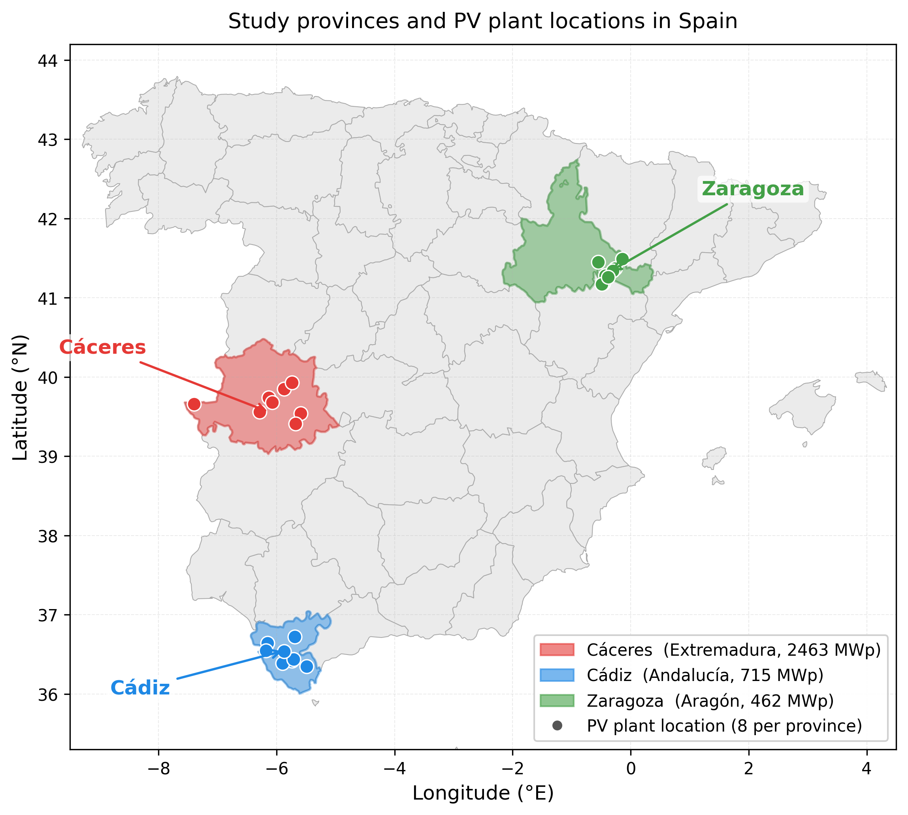

# ML Solar Forecast

Machine learning models for day-ahead solar power generation forecasting across three Spanish provinces, using hourly ESIOS measured generation data and ERA5 reanalysis weather data.



## Provinces

| Province | Region | Climate | Top-8 Capacity (MWp) | Solar Plants |
|----------|--------|---------|----------------------|--------------|
| **Caceres** | Extremadura | Inland semi-arid | 2,463 | Arenales, Campo Aranuelo, Cedillo, Francisco Pizarro, Oriol, Tagus, Talasol, Talayuela |
| **Cadiz** | Andalucia | Coastal lowland | 715 | Amazon Arco, Arenosas, Cartuja, El Yarte, La Guita, Las Quinientas, Miramundo, Puerto Real |
| **Zaragoza** | Aragon | Ebro valley continental | 462 | Alizarsun, Amazon, Azaila, Barrica, Esplendor, Los Belos, Talento, Tico |

## Models

Six model variants are trained per province:

**TFT (Temporal Fusion Transformer)** -- sequence model with 168h encoder, 24h forecast horizon:
1. **Standard** -- observed ERA5 weather in encoder only; decoder uses 9 known-future features (calendar + solar geometry)
2. **NWP** -- Open-Meteo weather forecasts as known-future features in both encoder and decoder (16 known-future features)
3. **Perfect Forecast** -- ERA5 reanalysis as known-future features (performance ceiling)

**XGBoost** -- tabular baseline (no sequences, current-timestep features only):
4. **Standard** -- 9 known-future features (calendar + solar geometry)
5. **NWP** -- 16 known-future features (calendar + solar geometry + NWP forecasts)

**Stacking Ensemble** -- combines TFT NWP + XGBoost NWP via Ridge Regression:
6. **Stacking** -- meta-learner trained on validation predictions from both NWP base models

## Project Structure

```text
ML-solar-forecast/
|-- regional_analysis/              # Per-province modelling pipelines
|   |-- caceres/                    # Caceres (Extremadura)
|   |-- cadiz/                      # Cadiz (Andalucia)
|   |-- zaragoza/                   # Zaragoza (Aragon)
|   |-- zaragoza_analysis/          # Additional Zaragoza stacking analysis
|-- miscellaneous/                  # Utility scripts and cross-province notebooks
|   |-- cross_province_comparison.ipynb   # Cross-province results comparison
|   |-- province_climate_comparison.ipynb # Climate characterization notebook
|   |-- generate_comparison_figs.py       # Generate cross-province figures
|   |-- bootstrap_confidence_intervals.py # Bootstrap CIs on test metrics
|   |-- figure_style.py                   # Unified matplotlib style module
|   |-- download_era5.py                  # ERA5 data download script
|-- figures/                        # All output figures (PNG + PDF)
|-- README.md
|-- environment.yml                 # Conda environment specification
|-- report.pdf
```

Each province directory follows the same pipeline structure:

```text
<province>/
|-- 01_data_assembly.ipynb          # Assemble ESIOS + ERA5 raw data
|-- 02_eda.ipynb                    # Exploratory data analysis
|-- 03_data_preprocessing.ipynb     # Preprocessing for standard TFT
|-- 04_tft_training.ipynb           # TFT Standard training + HP search
|-- 05_tft_perfect_forecast.ipynb   # TFT Perfect Forecast training
|-- 06_tft_evaluation.ipynb         # TFT Standard evaluation
|-- 07_tft_pf_evaluation.ipynb      # TFT Perfect Forecast evaluation
|-- 08_nwp_data_assembly.ipynb      # Assemble Open-Meteo NWP data
|-- 09_nwp_preprocessing.ipynb      # Preprocessing for NWP features
|-- 10_nwp_training.ipynb           # TFT NWP training + HP search
|-- 11_nwp_evaluation.ipynb         # TFT NWP evaluation
|-- 12_xgboost_baseline.ipynb       # XGBoost Standard + NWP baselines
|-- 13_stacking_ensemble.ipynb      # Stacking ensemble (TFT NWP + XGBoost NWP)
|-- data/                           # Raw and processed datasets
|-- models/                         # Trained models and results (git-ignored)
|   |-- standard/                   # TFT Standard checkpoint + HP results
|   |-- perfect_forecast/           # TFT Perfect Forecast checkpoint + HP results
|   |-- nwp_forecast/               # TFT NWP checkpoint + HP results
|   |-- xgboost/                    # XGBoost HP study results
|-- lightning_logs/                 # PyTorch Lightning TensorBoard logs (git-ignored)
```

## Data Sources

- **ESIOS** -- Hourly measured solar PV generation per province (Red Electrica de Espana)
- **ERA5-Land** -- Hourly reanalysis weather data per plant location (Copernicus Climate Data Store): temperature, pressure, precipitation, radiation, heat flux
- **Open-Meteo** -- Hourly NWP weather forecasts per plant location (used as known-future features in NWP model variants)

## Setup

```bash
conda env create -f environment.yml
conda activate solar
```
